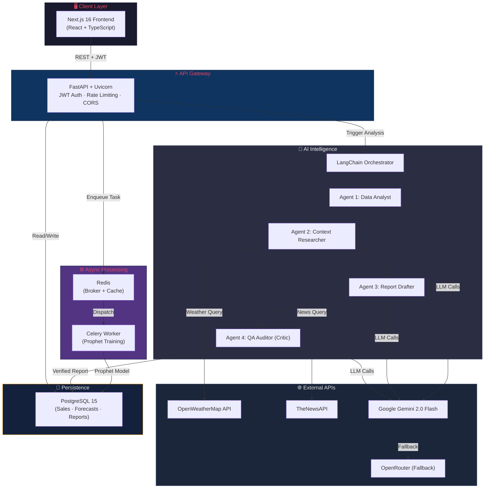

<div align="center">

# 🏭 Enterprise Multimodal Demand Forecaster

### _Where Statistical Math Meets Generative AI for Supply Chain Intelligence_

[](https://python.org)
[](https://fastapi.tiangolo.com)
[](https://nextjs.org)
[](https://postgresql.org)
[](https://docs.celeryq.dev)
[](https://langchain.com)
[](https://redis.io)
[](https://docker.com)
[](LICENSE)

<br/>

**An end-to-end, production-grade supply chain forecasting platform that fuses statistical time-series math (Facebook Prophet) with real-time contextual intelligence (Weather & News APIs) through a hallucination-proof, multi-agent LLM pipeline.**

_Not just a forecast. An AI-verified, context-aware inventory intelligence report._

<br/>

[Quick Start](#-quick-start) · [Architecture](#-system-architecture) · [AI Pipeline](#-the-4-agent-actor-critic-llm-pipeline) · [Infrastructure](#%EF%B8%8F-enterprise-infrastructure) · [API Docs](#-api-reference)

</div>

---

## 🎯 The Elevator Pitch

> Most demand forecasters stop at the math. This one doesn't.

Traditional forecasting tools give you a number: _"Sell 68 units next week."_ But they can't tell you **why**, and they can't account for a sudden heatwave, a viral TikTok trend, or a port strike.

**This system solves that.** It runs Facebook Prophet for the statistical forecast, then feeds those numbers — along with **live weather data** and **real-time news headlines** — into a **4-Agent AI verification pipeline** powered by Google Gemini 2.0 Flash. The result is a markdown intelligence report that is:

- 📊 **Mathematically Grounded** — Every number traces back to the Prophet model's confidence intervals.
- 🌦️ **Context-Aware** — Factors in weather patterns and breaking news for the target market.
- 🛡️ **Hallucination-Proof** — A dedicated QA Auditor agent at `Temperature 0.0` cross-checks every claim against the raw data before the report is finalized.

---

## 🏛️ System Architecture



---

## 🧠 The 4-Agent Actor-Critic LLM Pipeline

This is the core differentiator. Instead of a single LLM call that can hallucinate freely, the system uses a **multi-agent verification pipeline** inspired by the Actor-Critic pattern from reinforcement learning.

```
┌─────────────────────────────────────────────────────────────────┐
│                    PROPHET FORECAST SUMMARY                     │
│              (Mathematical bounds & trend data)                 │
└────────────────────────────┬────────────────────────────────────┘
                             │
                             ▼
┌─────────────────────────────────────────────────────────────────┐
│  AGENT 1: DATA ANALYST                          [Temp: 0.2]    │
│  ─────────────────────────────────────────────────────────────  │
│  Extracts strict mathematical bounds from the Prophet model.    │
│  Identifies trajectory (increasing / decreasing / flat).        │
│  Output: Bulleted "Math Facts" — the ground truth.              │
└────────────────────────────┬────────────────────────────────────┘
                             │
                             ▼
┌─────────────────────────────────────────────────────────────────┐
│  AGENT 2: CONTEXT RESEARCHER                    [Temp: 0.2]    │
│  ─────────────────────────────────────────────────────────────  │
│  Queries live OpenWeatherMap & TheNewsAPI data.                  │
│  Uses SEMANTIC product strings (e.g., "umbrellas",              │
│  not "Item 1") for highly relevant news retrieval.              │
│  Output: Contextual risk/opportunity summary.                   │
└────────────────────────────┬────────────────────────────────────┘
                             │
                             ▼
┌─────────────────────────────────────────────────────────────────┐
│  AGENT 3: SUPPLY CHAIN DIRECTOR (DRAFTER)       [Temp: 0.5]    │
│  ─────────────────────────────────────────────────────────────  │
│  Synthesizes Math Facts + Context into a comprehensive          │
│  Markdown report with: Executive Summary, Quantitative          │
│  Forecast, Qualitative Context, Actionable Recommendations.     │
│  Output: Draft intelligence report.                             │
└────────────────────────────┬────────────────────────────────────┘
                             │
                             ▼
┌─────────────────────────────────────────────────────────────────┐
│  AGENT 4: QA AUDITOR (THE CRITIC)               [Temp: 0.0]    │
│  ─────────────────────────────────────────────────────────────  │
│  🛡️ THE HALLUCINATION FIREWALL                                 │
│  Operates at Temperature 0.0 for maximum determinism.           │
│  Cross-checks every number in the Draft against Math Facts.     │
│  If hallucinations detected → rewrites. If clean → approves.   │
│  Output: Final verified report (or corrected version).          │
└─────────────────────────────────────────────────────────────────┘
```

### Why This Matters

| Problem | Traditional Approach | Our Approach |
|---------|---------------------|--------------|
| LLM invents numbers | Hope for the best | **Agent 4 cross-checks every claim** |
| No real-world context | Pure statistical model | **Live weather + news integration** |
| Single point of failure | One LLM call | **4-stage pipeline with fallback models** |
| Opaque reasoning | Black-box output | **Observable, traceable agent chain** |

---

## 🛡️ Enterprise Infrastructure

This isn't a prototype. Every layer is engineered for production reliability.

### ⚡ Asynchronous ML with Celery + Redis

Prophet model training is **CPU-intensive** and can take 10-30 seconds. Running it on the FastAPI event loop would block all other requests. Instead:

```
Client Request → FastAPI enqueues task → Redis broker → Celery Worker picks up
                                                          ↓
Client polls /task/{id} ← FastAPI reads result ← Worker stores in PostgreSQL
```

- The API remains responsive under load.
- Workers scale horizontally — add more containers under high demand.
- Task status is tracked via Celery's result backend.

### 🔄 API Resilience with Tenacity + Fallbacks

```python
# Exponential backoff: waits 4s, then 8s, then gives up after 3 attempts
@retry(wait=wait_exponential(multiplier=1, min=4, max=10), stop=stop_after_attempt(3))
def run_verification_pipeline(forecast_summary, weather_text, news_text):
    ...
```

- **Primary Model:** Google Gemini 2.0 Flash (via `langchain-google-genai`)
- **Automatic Fallback:** OpenRouter Free Tier (via `langchain-openai`)
- **Retry Strategy:** Exponential backoff with `tenacity` — no more brittle `time.sleep()` hacks.

If Gemini returns a 429 or 500, the system automatically:
1. Retries with exponential backoff (4s → 8s → 10s)
2. Falls back to OpenRouter if all retries fail

### 📊 Observability

- **LangChain Callbacks:** `StdOutCallbackHandler` traces every agent invocation — latency, token count, and execution path.
- **Structured Logging:** Every pipeline stage prints status for container log aggregation.
- **Production Ready:** Swap `StdOutCallbackHandler` for [Langfuse](https://langfuse.com) or [LangSmith](https://smith.langchain.com) for full production tracing dashboards.

### 🔒 Security

| Layer | Implementation |
|-------|---------------|
| **Authentication** | JWT Bearer tokens with `python-jose` + `passlib` |
| **Rate Limiting** | `slowapi` with configurable per-endpoint limits |
| **CORS** | Environment-driven via `FRONTEND_URL` (no wildcards in production) |
| **Secrets** | All API keys via `.env` — never hardcoded |
| **Multi-Tenancy** | Merchant-scoped data isolation at the DB query level |

---

## 🚀 Quick Start

Get the entire platform running locally in **3 steps**.

### Prerequisites

- [Docker Desktop](https://www.docker.com/products/docker-desktop/) installed and running
- API keys for: [Google AI Studio](https://aistudio.google.com/apikey), [OpenWeatherMap](https://openweathermap.org/api), [TheNewsAPI](https://www.thenewsapi.com/)

### Step 1: Configure Environment

Create a `.env` file in the project root:

```env
# ── AI & External APIs ──────────────────────────────────
GEMINI_API_KEY=your_gemini_api_key_here
OPENROUTER_API_KEY=your_openrouter_key_here
WEATHERAPI_KEY=your_openweather_key_here
NEWSAPI_AI_KEY=your_newsapi_key_here

# ── Auth ────────────────────────────────────────────────
SECRET_KEY=your_random_secret_key_here

# ── Database & Caching ──────────────────────────────────
POSTGRES_PASSWORD=your_secure_password
DATABASE_URL=postgresql://postgres:your_secure_password@db:5432/antigravity_db
REDIS_URL=redis://redis:6379/0
```

### Step 2: Launch the Platform

```bash
docker-compose up --build
```

This spins up **5 containers**: PostgreSQL, Redis, FastAPI API, Celery Worker, and Next.js Frontend.

### Step 3: Open the App

| Service | URL | Description |
|---------|-----|-------------|
| 🖥️ **Frontend** | [http://localhost:3000](http://localhost:3000) | The main dashboard UI |
| ⚡ **API Docs** | [http://localhost:8000/docs](http://localhost:8000/docs) | Interactive Swagger documentation |
| 💾 **PostgreSQL** | `localhost:5432` | Direct database access |
| 📦 **Redis** | `localhost:6379` | Cache & task broker |

### First Run Walkthrough

1. **Register** a new account on the login page.
2. **Upload** a CSV file with columns: `date`, `store`, `item`, `sales`.
3. **Select** a store and product from the auto-populated dropdowns.
4. **Enter** a target city for weather context (e.g., "New York").
5. **Click** "Generate Intelligence Report" and watch the 4-agent pipeline work.

---

## 📁 Project Structure

```
multimodal_demand_forecaster/
│
├── 🐍 Backend (FastAPI)
│   ├── api.py                  # API gateway — routes, auth, CORS, rate limiting
│   ├── agents.py               # 4-Agent LangChain pipeline with Tenacity retries
│   ├── forecast_model.py       # Prophet model — training & prediction logic
│   ├── celery_worker.py        # Async Celery task for background forecasting
│   ├── models.py               # SQLAlchemy ORM — Products, Sales, Forecasts
│   ├── database.py             # PostgreSQL engine & session management
│   ├── auth.py                 # JWT authentication & merchant management
│   ├── weather_api.py          # OpenWeatherMap integration
│   ├── news_api.py             # TheNewsAPI integration
│   ├── requirements.txt        # Python dependencies
│   └── Dockerfile              # Backend container image
│
├── ⚛️ Frontend (Next.js)
│   └── frontend/
│       ├── src/app/page.tsx    # Main dashboard — upload, select, forecast
│       ├── src/lib/api.ts      # Auth-aware fetch wrapper
│       ├── package.json        # Node.js dependencies
│       └── Dockerfile          # Frontend container image
│
├── 🐳 Infrastructure
│   ├── docker-compose.yml      # Full stack orchestration (5 services)
│   └── .env                    # Environment configuration (git-ignored)
│
└── 📄 README.md                # You are here
```

---

## 📊 Data Format

The system accepts CSV or Excel files with the following schema:

| Column | Type | Example | Description |
|--------|------|---------|-------------|
| `date` | Date | `2018-01-01` | Sales date |
| `store` | Integer | `1` | Store identifier |
| `item` | String | `umbrella` | Semantic product name (or numeric ID) |
| `sales` | Integer | `13` | Units sold that day |

> **💡 Pro Tip:** Using semantic product names (like `"umbrella"` instead of `"1"`) dramatically improves the Context Researcher agent's ability to fetch relevant news and weather signals.

---

## 📡 API Reference

| Method | Endpoint | Description |
|--------|----------|-------------|
| `POST` | `/register` | Create a new merchant account |
| `POST` | `/token` | Authenticate and receive JWT |
| `POST` | `/upload-data` | Upload CSV/Excel sales data |
| `GET` | `/dashboard-meta` | Get available stores & products |
| `POST` | `/train-async` | Enqueue Prophet forecast (returns `task_id`) |
| `GET` | `/task/{task_id}` | Poll Celery task status |
| `POST` | `/analyze` | Trigger 4-Agent LLM pipeline |
| `GET` | `/forecast-history` | List all past forecasts |
| `GET` | `/forecast/{id}` | Get full forecast detail + report |
| `GET` | `/health` | Health check endpoint |

> Full interactive documentation available at [http://localhost:8000/docs](http://localhost:8000/docs)

---

## 🛠️ Tech Stack

| Layer | Technology | Purpose |
|-------|-----------|---------|
| **Frontend** | Next.js 16, React, TypeScript, Tailwind CSS | Reactive dashboard UI |
| **API Gateway** | FastAPI, Uvicorn, Pydantic | High-performance async API |
| **Authentication** | JWT (`python-jose`), `passlib`, `bcrypt` | Secure merchant auth |
| **Forecasting** | Facebook Prophet | Additive time-series modeling |
| **AI Orchestration** | LangChain, Gemini 2.0 Flash | Multi-agent LLM pipeline |
| **Task Queue** | Celery 5.4, Redis | Async background processing |
| **Database** | PostgreSQL 15, SQLAlchemy 2.0, Alembic | Persistent data storage |
| **Resilience** | Tenacity, OpenRouter (Fallback) | Retry logic & model failover |
| **Rate Limiting** | SlowAPI | Per-endpoint request throttling |
| **Caching** | Redis, fastapi-cache2 | Response & session caching |
| **Observability** | LangChain Callbacks | Agent tracing & monitoring |
| **Containerization** | Docker, Docker Compose | Reproducible deployments |

---

## 📄 License

This project is licensed under the **MIT License** — see the [LICENSE](LICENSE) file for details.

---

<div align="center">

**Built with ❤️ as a capstone project demonstrating production-grade AI engineering.**

_If this project helped you, consider giving it a ⭐_

</div>
